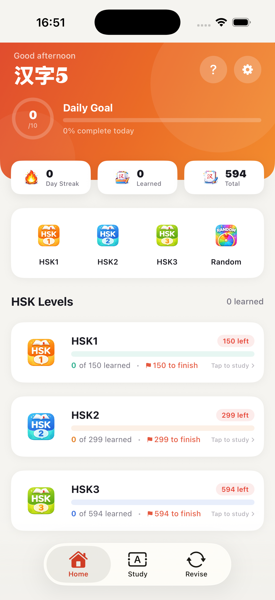

# HanziFive

A minimal iOS app for learning HSK Chinese with flashcards and writing practice.

## What it does

- Study by lesson (HSK 1-3)
- Review weak words in Revise
- Practice writing characters
